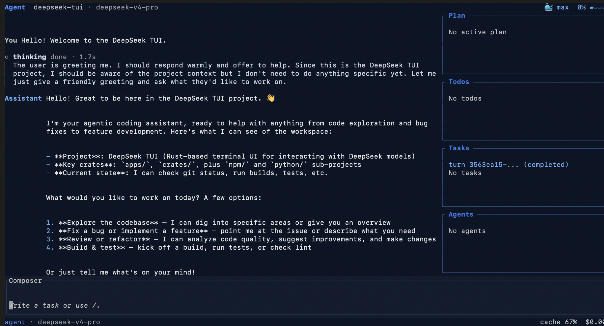

# DeepSeek TUI 中文版

> **本地化部署的中文终端编程智能体 | 100 万 token 上下文 | 思考模式流式推理 | 前缀缓存感知 | 开箱即用的 MCP 客户端、沙箱和持久化任务队列**

[English README](README.md)
[日本語 README](README.ja-JP.md)

---

## 🎯 项目定位

**DeepSeek TUI 中文版**是一个完全本地化部署的终端 AI 编程助手，专为中文用户优化：

- ✅ **完全中文化** - UI 界面、文档、提示信息全部中文
- ✅ **本地化部署** - 支持本地 LLM、局域网 LLM、云端 API
- ✅ **简化安装** - 一键安装脚本，无需复杂配置
- ✅ **智能增强** - 针对中文编程场景优化的提示词和工作流
- ✅ **免费方案** - 后期将集成免费 Web 版 LLM 会话功能

> 📚 **新用户？从这里开始**：
> - [快速开始.md](快速开始.md) - 3 分钟快速上手
> - [docs/zh/安装指南.md](docs/zh/安装指南.md) - 完整安装指南
> - [操作手册.md](操作手册.md) - 详细使用手册

## 🚀 快速安装

> ⚠️ **重要**：本项目必须编译后才能使用！

### 方式一：一键安装（推荐）

```bash
# 切换到项目目录
cd "F:\ai\codes\github\deepseektuizh"

# 一键编译安装
cargo install --path crates/cli --locked --force
cargo install --path crates/tui --locked --force

# 验证安装
deepseek --version
```

### 方式二：使用启动脚本

```powershell
# Windows 用户直接运行启动菜单
.\start-menu.ps1
```

### 其他安装方式

<details>
<summary>npm 安装（需要 Node.js）</summary>

```bash
npm install -g deepseek-tui
```
</details>

<details>
<summary>从源码安装（完整步骤）</summary>

```bash
# 1. 克隆仓库
git clone https://github.com/Hmbown/DeepSeek-TUI.git
cd DeepSeek-TUI

# 2. 安装 Rust（如果未安装）
# 访问 https://rustup.rs/ 

# 3. 编译安装
cargo install --path crates/cli --locked
cargo install --path crates/tui --locked

# 4. 验证
deepseek --version
```
</details>

<details>
<summary>中国大陆镜像加速</summary>

如果下载缓慢，配置 Cargo 镜像：

```toml
# ~/.cargo/config.toml
[source.crates-io]
replace-with = "tuna"

[source.tuna]
registry = "sparse+https://mirrors.tuna.tsinghua.edu.cn/crates.io-index/"
```
</details>

---

## 💡 本地化部署方案

### 方案一：本地 LLM（免费）

适合有本地 AI 模型的用户（如 llama.cpp、Ollama）：

```powershell
# 使用启动脚本
.\start-local-llm.ps1

# 或手动配置
$env:DEEPSEEK_PROVIDER = "openai"
$env:DEEPSEEK_BASE_URL = "http://192.168.2.5:1234/v1"
$env:DEEPSEEK_MODEL = "your-local-model"
$env:DEEPSEEK_API_KEY = "not-needed"
$env:DEEPSEEK_ALLOW_INSECURE_HTTP = "1"
deepseek
```

**优势**：
- ✅ 完全免费
- ✅ 数据隐私安全
- ✅ 离线可用

### 方案二：DeepSeek 官方 API（推荐）

适合需要最强能力的用户：

```bash
# 首次设置 API Key
deepseek auth set --provider deepseek

# 启动
deepseek --model auto
```

**优势**：
- ✅ 最强推理能力
- ✅ 100 万 token 上下文
- ✅ 按量付费，成本低

### 方案三：免费 Web 版 LLM（后期开发）

🔜 **规划中**：集成免费 Web 版 LLM 会话功能

- 无需 API Key
- 无需本地模型
- 适合轻度使用

---

[](https://github.com/Hmbown/DeepSeek-TUI/actions/workflows/ci.yml)
[](https://www.npmjs.com/package/deepseek-tui)
[](https://crates.io/crates/deepseek-tui-cli)
[DeepWiki project index](https://deepwiki.com/Hmbown/DeepSeek-TUI)



---

## ✨ 核心特性

### 🌐 完全中文化
- **UI 界面** - 所有菜单、提示、错误信息全部中文
- **完整文档** - 安装指南、操作手册、界面说明全部中文
- **中文优化** - 针对中文编程场景优化的提示词

### 🏠 本地化部署
- **本地 LLM** - 支持 llama.cpp、Ollama 等本地模型
- **局域网 LLM** - 支持局域网内的 AI 服务
- **云端 API** - 支持 DeepSeek 官方及其他云端服务
- **灵活切换** - 一键切换不同部署方案

### 🎨 智能增强
- **Auto 模式** - 自动选择最佳模型和推理强度
- **思考流式输出** - 实时观察 AI 推理过程
- **中文思维链** - 中文提问，中文思考，中文回答
- **100 万 token 上下文** - 超长对话记忆

### 🛠️ 简化工具
- **一键安装** - 简单几条命令完成安装
- **启动脚本** - 预设多种启动方案
- **配置向导** - 首次启动自动引导配置
- **故障诊断** - `deepseek doctor` 一键检查状态

---

## 📐 界面布局

采用清晰的双栏布局设计：

```
┌──────────────────────────────────────┬──────────────────────────────┐
│         顶部状态栏                    │        Tasks (任务面板)      │
│  [模式] [模型] [成本] [缓存]         │  - 当前任务状态              │
├──────────────────────────────────────┤  - 后台作业列表              │
│                                       │  - 错误日志                  │
│         主对话区 (左侧)               │  - 活动记录                  │
│         - 对话历史                     │  - 子代理状态                │
│         - AI 回复                     │                              │
│         - 工具调用                     │                              │
│         - 思考过程                     │                              │
│                                       │                              │
├──────────────────────────────────────┤                              │
│         输入区 (底部)                 │                              │
│  > 在这里输入您的问题...              │                              │
└──────────────────────────────────────┴──────────────────────────────┘
```

> 📚 详细布局说明：[docs/zh/界面布局说明.md](docs/zh/界面布局说明.md)

---

## 🚦 三种工作模式

| 模式 | 图标 | 说明 | 适用场景 |
|------|------|------|---------|
| **Plan** | 🔍 | 只读调查，不修改文件 | 代码审查、问题诊断 |
| **Agent** | 🤖 | 交互式，需要批准（默认） | 日常编程 |
| **YOLO** | ⚡ | 自动批准所有操作 | 受信任的工作环境 |

---

## ⌨️ 常用快捷键

| 快捷键 | 功能 |
|--------|------|
| `Tab` | 切换工作模式 / 自动补全 |
| `Shift+Tab` | 切换推理深度 (off → high → max) |
| `Enter` | 发送消息 |
| `Shift+Enter` | 换行 |
| `Ctrl+K` | 命令面板 |
| `Ctrl+R` | 恢复旧会话 |
| `Esc` | 取消/返回 |
| `/help` | 显示帮助 |
| `/theme` | 切换主题 |
| `/compact` | 压缩上下文 |

> 📚 完整快捷键列表：[docs/KEYBINDINGS.md](docs/KEYBINDINGS.md)

---

## 🔮 后期开发规划

### 🎯 即将推出的功能

#### 1. 免费 Web 版 LLM 集成
- **目标**：无需 API Key、无需本地模型即可使用
- **方案**：集成免费 Web 版 LLM 会话功能
- **适用**：轻度用户、快速体验、临时任务

#### 2. 一键安装器
- **目标**：简化安装流程
- **功能**：
  - 自动检测系统环境
  - 自动安装 Rust 工具链
  - 一键编译安装
  - 自动配置环境变量

#### 3. 图形化配置向导
- **目标**：零配置门槛
- **功能**：
  - 可视化选择部署方案
  - 自动测试连接
  - 一键应用配置

#### 4. 中文 Skill 市场
- **目标**：丰富的中文编程技能包
- **内容**：
  - 中文代码规范
  - 中文文档模板
  - 中文测试框架
  - 中文项目脚手架

---

## 📚 文档导航

### 新手入门
- [快速开始.md](快速开始.md) - 3 分钟快速上手 ⭐ 推荐
- [docs/zh/安装指南.md](docs/zh/安装指南.md) - 完整安装指南
- [操作手册.md](操作手册.md) - 详细使用手册

### 进阶使用
- [docs/zh/界面布局说明.md](docs/zh/界面布局说明.md) - 界面布局详解
- [docs/zh/CONFIGURATION_GUIDE.md](docs/zh/CONFIGURATION_GUIDE.md) - 配置指南
- [docs/MODES.md](docs/MODES.md) - 工作模式说明

### 完整文档
| 文档 | 说明 |
|------|------|
| [ARCHITECTURE.md](docs/ARCHITECTURE.md) | 代码架构详解 |
| [MCP.md](docs/MCP.md) | MCP 协议集成 |
| [SUBAGENTS.md](docs/SUBAGENTS.md) | 子智能体指南 |
| [KEYBINDINGS.md](docs/KEYBINDINGS.md) | 完整快捷键列表 |
| [CHANGELOG.md](CHANGELOG.md) | 更新历史 |

> 📚 更多文档：[docs/zh/README.md](docs/zh/README.md)

---

## 版本说明

每个版本的具体变更见 [CHANGELOG.md](CHANGELOG.md)。README 只保留当前
安装方式、核心工作流、模型提供方配置、运行时接口和扩展入口。

---

## 使用方式

```bash
deepseek                                       # 交互式 TUI
deepseek "explain this function"              # 一次性提示
deepseek exec --auto --output-format stream-json "fix this bug" # 面向后端集成的 NDJSON 流
deepseek exec --resume <SESSION_ID> "follow up" # 继续非交互会话
deepseek --model deepseek-v4-flash "summarize" # 指定模型
deepseek --model auto "fix this bug"          # 自动选择模型 + 推理强度
deepseek --yolo                                # 自动批准工具
deepseek auth set --provider deepseek         # 保存 API key
deepseek doctor                                # 检查配置和连接
deepseek doctor --json                         # 机器可读诊断
deepseek setup --status                        # 只读安装状态
deepseek setup --tools --plugins               # 创建本地工具和插件目录
deepseek models                                # 列出可用 API 模型
deepseek sessions                              # 列出已保存会话
deepseek resume --last                         # 恢复最近会话
deepseek resume <SESSION_ID>                   # 按 UUID 恢复指定会话
deepseek fork <SESSION_ID>                     # 在指定轮次分叉会话
deepseek serve --http                          # HTTP/SSE API 服务
deepseek serve --acp                           # Zed/自定义智能体的 ACP stdio 适配器
deepseek run pr <N>                            # 获取 PR 并预填审查提示
deepseek mcp list                              # 列出已配置 MCP 服务器
deepseek mcp validate                          # 校验 MCP 配置和连接
deepseek mcp-server                            # 启动 dispatcher MCP stdio 服务器
deepseek update                                # 检查并应用二进制更新
```

Docker 镜像发布在 GHCR 上：

```bash
docker volume create deepseek-tui-home

docker run --rm -it \
  -e DEEPSEEK_API_KEY="$DEEPSEEK_API_KEY" \
  -v deepseek-tui-home:/home/deepseek/.deepseek \
  -v "$PWD:/workspace" \
  -w /workspace \
  ghcr.io/hmbown/deepseek-tui:latest
```

固定 tag、本地构建、volume 权限和非交互管道用法见 [docs/DOCKER.md](docs/DOCKER.md)。

### Zed / ACP

DeepSeek 可作为自定义 Agent Client Protocol 服务器运行，供 Zed 等编辑器通过 stdio 调用本地 ACP 智能体。在 Zed 中添加自定义智能体服务器：

```json
{
  "agent_servers": {
    "DeepSeek": {
      "type": "custom",
      "command": "deepseek",
      "args": ["serve", "--acp"],
      "env": {}
    }
  }
}
```

首个 ACP 切片支持通过现有 DeepSeek 配置/API 密钥创建新会话和提示响应。工具支持的编辑和检查点回放尚未通过 ACP 暴露。

### 常用快捷键

| 按键 | 功能 |
|---|---|
| `Tab` | 补全 `/` 或 `@`；运行中则把草稿排队；否则切换模式 |
| `Shift+Tab` | 切换推理强度：off → high → max |
| `F1` | 可搜索帮助面板 |
| `Esc` | 返回 / 关闭 |
| `Ctrl+K` | 命令面板 |
| `Ctrl+R` | 恢复旧会话 |
| `Alt+R` | 搜索提示历史和恢复草稿 |
| `Ctrl+S` | 暂存当前草稿（`/stash list`、`/stash pop` 恢复） |
| `@path` | 在输入框中附加文件或目录上下文 |
| `↑`（在输入框开头） | 选择附件行进行移除 |

完整快捷键目录：[docs/KEYBINDINGS.md](docs/KEYBINDINGS.md)。

---

## 模式

| 模式 | 行为 |
|---|---|
| **Plan** 🔍 | 只读调查；模型先探索并提出计划（`update_plan` + `checklist_write`），然后再做更改 |
| **Agent** 🤖 | 默认交互模式；多步工具调用带审批门禁 |
| **YOLO** ⚡ | 在可信工作区自动批准工具；仍会维护计划和清单以保持可见性 |

---

## 配置

用户配置：`~/.deepseek/config.toml`。项目覆盖：`<workspace>/.deepseek/config.toml`（以下密钥被拒绝：`api_key`、`base_url`、`provider`、`mcp_config_path`）。完整选项见 [config.example.toml](config.example.toml)。

常用环境变量：

| 变量 | 用途 |
|---|---|
| `DEEPSEEK_API_KEY` | DeepSeek API key |
| `DEEPSEEK_BASE_URL` | API base URL |
| `DEEPSEEK_HTTP_HEADERS` | 可选模型请求头，例如 `X-Model-Provider-Id=your-model-provider` |
| `DEEPSEEK_MODEL` | 默认模型 |
| `DEEPSEEK_STREAM_IDLE_TIMEOUT_SECS` | 流式响应空闲超时秒数，默认 `300`，限制在 `1..=3600` |
| `DEEPSEEK_PROVIDER` | `deepseek`（默认）、`nvidia-nim`、`openai`、`openrouter`、`novita`、`atlascloud`、`fireworks`、`sglang`、`vllm`、`ollama` |
| `DEEPSEEK_PROFILE` | 配置 profile 名称 |
| `DEEPSEEK_MEMORY` | 设为 `on` 启用用户记忆 |
| `DEEPSEEK_ALLOW_INSECURE_HTTP=1` | 在可信网络上允许非本机 `http://` API base URL |
| `NVIDIA_API_KEY` / `OPENAI_API_KEY` / `OPENROUTER_API_KEY` / `NOVITA_API_KEY` / `ATLASCLOUD_API_KEY` / `FIREWORKS_API_KEY` / `SGLANG_API_KEY` / `VLLM_API_KEY` / `OLLAMA_API_KEY` | 提供商认证 |
| `OPENAI_BASE_URL` / `OPENAI_MODEL` | 通用 OpenAI 兼容端点和模型 ID |
| `ATLASCLOUD_BASE_URL` / `ATLASCLOUD_MODEL` | AtlasCloud 端点和模型覆盖 |
| `OPENROUTER_BASE_URL` | OpenRouter 端点覆盖 |
| `NOVITA_BASE_URL` | Novita 端点覆盖 |
| `FIREWORKS_BASE_URL` | Fireworks 端点覆盖 |
| `SGLANG_BASE_URL` | 自托管 SGLang 端点 |
| `SGLANG_MODEL` | 自托管 SGLang 模型 ID |
| `VLLM_BASE_URL` | 自托管 vLLM 端点 |
| `VLLM_MODEL` | 自托管 vLLM 模型 ID |
| `OLLAMA_BASE_URL` | 自托管 Ollama 端点 |
| `OLLAMA_MODEL` | 自托管 Ollama 模型标签 |
| `NO_ANIMATIONS=1` | 启动时强制无障碍模式 |
| `SSL_CERT_FILE` | 企业代理的自定义 CA 包 |

`locale` 会控制界面语言，并作为模型自然语言的兜底设置；最新用户消息的语言优先级更高。也就是说，即使系统 locale 是英文，用户用中文提问时，V4 的 `reasoning_content` 和最终回复也应该使用中文。可在 `config.toml` 中设置 `locale`、使用 `/config locale zh-Hans`、或依赖 `LC_ALL`/`LANG`。详见 [docs/LOCALIZATION.md](docs/LOCALIZATION.md) 和 [docs/CONFIGURATION.md](docs/CONFIGURATION.md)。

### 切换为中文界面

如果界面是其他语言，可以在 TUI 内一键切换为简体中文：

1. 在 Composer 里输入 `/config`，按 Tab 或 Enter 打开配置面板。
2. 选择 **Edit locale**，在 `New:` 字段输入 `zh-Hans`，按 Enter 应用。

可选语言：`auto` | `en` | `ja` | `zh-Hans` | `pt-BR`。

也可以在 `~/.deepseek/config.toml` 里直接设置 `locale = "zh-Hans"`，或通过 `LC_ALL` / `LANG` 环境变量自动选择：

```toml
# ~/.deepseek/config.toml
[tui]
locale = "zh-Hans"
```

或者通过环境变量（中文系统通常已自动生效）：

```bash
LANG=zh_CN.UTF-8 deepseek run
```

---

## 模型和价格

| 模型 | 上下文 | 输入（缓存命中） | 输入（缓存未命中） | 输出 |
|---|---|---|---|---|
| `deepseek-v4-pro` | 1M | $0.003625 / 1M* | $0.435 / 1M* | $0.87 / 1M* |
| `deepseek-v4-flash` | 1M | $0.0028 / 1M | $0.14 / 1M | $0.28 / 1M |

旧别名 `deepseek-chat` / `deepseek-reasoner` 映射到 `deepseek-v4-flash`。NVIDIA NIM 变体使用你的 NVIDIA 账号条款。

*DeepSeek Pro 价格是限时 75% 折扣，有效期到 2026-05-31 15:59 UTC；该时间之后 TUI 成本估算会回退到 Pro 基础价格。*

> [!Note]
> 关于 DeepSeek-V4-Pro 的最新定价信息，请参阅官方 [DeepSeek 定价页面](https://api-docs.deepseek.com/zh-cn/quick_start/pricing)，请注意目前可享受 75% 的折扣，该优惠有效期至 **2026 年 5 月 31 日 23:59（北京时间）**。此外，README 文档中所列出的所有价格，均与官方发布的数值保持一致。

---

## 创建和安装技能

DeepSeek TUI 从工作区目录（`.agents/skills` → `skills` → `.opencode/skills` → `.claude/skills`）和全局 `~/.deepseek/skills` 发现技能。每个技能是一个包含 `SKILL.md` 的目录：

```text
~/.deepseek/skills/my-skill/
└── SKILL.md
```

需要 YAML frontmatter：

```markdown
---
name: my-skill
description: 当 DeepSeek 需要遵循我的自定义工作流时使用这个技能。
---

# My Skill
这里写给智能体的指令。
```

常用命令：`/skills`（列出）、`/skill <name>`（激活）、`/skill new`（创建）、`/skill install github:<owner>/<repo>`（社区）、`/skill update` / `uninstall` / `trust`。社区技能直接从 GitHub 安装，无需后端服务。已安装技能在模型可见的会话上下文里列出；当任务匹配技能描述时，智能体可通过 `load_skill` 工具自动读取对应的 `SKILL.md`。

---

## 文档

| 文档 | 主题 |
|---|---|
| [ARCHITECTURE.md](docs/ARCHITECTURE.md) | 代码库内部结构 |
| [CONFIGURATION.md](docs/CONFIGURATION.md) | 完整配置参考 |
| [MODES.md](docs/MODES.md) | Plan / Agent / YOLO 模式 |
| [MCP.md](docs/MCP.md) | Model Context Protocol 集成 |
| [RUNTIME_API.md](docs/RUNTIME_API.md) | HTTP/SSE API 服务 |
| [INSTALL.md](docs/INSTALL.md) | 各平台安装指南 |
| [DOCKER.md](docs/DOCKER.md) | GHCR 镜像、volume 和 Docker 用法 |
| [CNB_MIRROR.md](docs/CNB_MIRROR.md) | CNB 镜像和中国大陆友好安装说明 |
| [TENCENT_CLOUD_REMOTE_FIRST.md](docs/TENCENT_CLOUD_REMOTE_FIRST.md) | 腾讯云/CNB/Lighthouse/飞书远程优先路径 |
| [TENCENT_LIGHTHOUSE_HK.md](docs/TENCENT_LIGHTHOUSE_HK.md) | 腾讯云 Lighthouse 香港实例配置 |
| [MEMORY.md](docs/MEMORY.md) | 用户记忆功能指南 |
| [SUBAGENTS.md](docs/SUBAGENTS.md) | 子智能体角色分类与生命周期 |
| [KEYBINDINGS.md](docs/KEYBINDINGS.md) | 完整快捷键目录 |
| [RELEASE_RUNBOOK.md](docs/RELEASE_RUNBOOK.md) | 发布流程 |
| [LOCALIZATION.md](docs/LOCALIZATION.md) | UI 语言矩阵与切换 |
| [OPERATIONS_RUNBOOK.md](docs/OPERATIONS_RUNBOOK.md) | 运维和恢复 |

完整更新历史：[CHANGELOG.md](CHANGELOG.md)。

---

## 致谢

- **[DeepSeek](https://github.com/deepseek-ai)** — 感谢 DeepSeek 提供模型与支持，让每一次交互成为可能。
- **[DataWhale](https://github.com/datawhalechina)** — 感谢 DataWhale 的支持，并欢迎我们加入“鲸兄弟”大家庭。
- **[OpenWarp](https://github.com/zerx-lab/warp)** — 感谢 OpenWarp 优先支持 DeepSeek TUI，并一起打磨更好的终端智能体体验。
- **[Open Design](https://github.com/nexu-io/open-design)** — 感谢 Open Design 对面向设计的智能体工作流提供支持与协作。

本项目由不断壮大的贡献者社区共同打造：

- **[merchloubna70-dot](https://github.com/merchloubna70-dot)** — 28 个 PR，涵盖功能、修复和 VS Code 扩展基础架构 (#645–#681)
- **[WyxBUPT-22](https://github.com/WyxBUPT-22)** — Markdown 表格、粗体/斜体和水平线渲染 (#579)
- **[loongmiaow-pixel](https://github.com/loongmiaow-pixel)** — Windows + 中国安装文档 (#578)
- **[20bytes](https://github.com/20bytes)** — 用户记忆文档和帮助优化 (#569)
- **[staryxchen](https://github.com/staryxchen)** — glibc 兼容性预检 (#556)
- **[Vishnu1837](https://github.com/Vishnu1837)** — glibc 兼容性改进 (#565)
- **[shentoumengxin](https://github.com/shentoumengxin)** — Shell `cwd` 边界验证 (#524)
- **[toi500](https://github.com/toi500)** — Windows 粘贴修复报告
- **[xsstomy](https://github.com/xsstomy)** — 终端启动重绘报告
- **[melody0709](https://github.com/melody0709)** — 斜杠前缀回车激活报告
- **[lloydzhou](https://github.com/lloydzhou)** 和 **[jeoor](https://github.com/jeoor)** — 压缩成本报告；lloydzhou 还贡献了确定性的环境上下文注入 (#813, #922) 和 KV 前缀缓存稳定化 (#1080)
- **[Agent-Skill-007](https://github.com/Agent-Skill-007)** — README 清晰化改进 (#685)
- **[woyxiang](https://github.com/woyxiang)** — Windows 安装文档 (#696)
- **[wangfeng](mailto:wangfengcsu@qq.com)** — 价格/折扣信息更新 (#692)
- **[zichen0116](https://github.com/zichen0116)** — CODE_OF_CONDUCT.md (#686)
- **[dfwqdyl-ui](https://github.com/dfwqdyl-ui)** — 模型 ID 大小写兼容性报告 (#729)
- **[Oliver-ZPLiu](https://github.com/Oliver-ZPLiu)** — `working...` 卡死状态 Bug 报告和 Windows 剪贴板兜底修复 (#738, #850)
- **[reidliu41](https://github.com/reidliu41)** — 退出后的恢复提示、工作区信任持久化、Ollama provider 支持，以及思考块流式终结修复 (#863, #870, #921, #1078)
- **[xieshutao](https://github.com/xieshutao)** — 纯 Markdown skill 兜底解析 (#869)
- **[GK012](https://github.com/GK012)** — npm wrapper 的 `--version` 兜底 (#885)
- **[y0sif](https://github.com/y0sif)** — 直接子智能体完成后唤醒父级 turn loop (#901)
- **[mac119](https://github.com/mac119)** 和 **[leo119](https://github.com/leo119)** — `deepseek update` 命令文档 (#838, #917)
- **[dumbjack](https://github.com/dumbjack)** / **浩淼的mac** — shell 命令空字节安全加固 (#706, #918)
- **macworkers** — fork 完成后显示新 session id (#600, #919)
- **zero** 和 **[zerx-lab](https://github.com/zerx-lab)** — 通知条件配置和更完整的 OSC 9 通知正文 (#820, #920)
- **[chnjames](https://github.com/chnjames)** — @mention 补全缓存、配置恢复优化，以及 Windows UTF-8 shell 输出修复 (#849, #927, #982, #1018)
- **[angziii](https://github.com/angziii)** — 配置安全、异步清理、Docker 加固和命令安全修复 (#822, #824, #827, #831, #833, #835, #837)
- **[elowen53](https://github.com/elowen53)** — UTF-8 解码和确定性测试覆盖 (#825, #840)
- **[wdw8276](https://github.com/wdw8276)** — 用于自定义 session 标题的 `/rename` 命令 (#836)
- **[banqii](https://github.com/banqii)** — `.cursor/skills` 发现路径支持 (#817)
- **[junskyeed](https://github.com/junskyeed)** — API 请求动态 `max_tokens` 计算 (#826)
- **Hafeez Pizofreude** — `fetch_url` 的 SSRF 保护和 Star History 图表
- **Unic (YuniqueUnic)** — 基于 schema 的配置 UI（TUI + web）
- **Jason** — SSRF 安全加固
- **[axobase001](https://github.com/axobase001)** — 快照孤儿文件清理、npm 安装守卫、会话遥测修复、模型作用域缓存清理、符号链接技能支持，以及 npm 镜像逃生路径指引 (#975, #1032, #1047, #1049, #1052, #1019, #1051, #1056)
- **[MengZ-super](https://github.com/MengZ-super)** — `/theme` 命令基础和 SSE gzip/brotli 解压支持 (#1057, #1061)
- **[DI-HUO-MING-YI](https://github.com/DI-HUO-MING-YI)** — Plan 模式只读沙箱安全修复 (#1077)
- **[bevis-wong](https://github.com/bevis-wong)** — 粘贴-回车自动提交问题的精确复现 (#1073)
- **[Duducoco](https://github.com/Duducoco)** 和 **[AlphaGogoo](https://github.com/AlphaGogoo)** — 技能斜杠菜单和 `/skills` 覆盖范围修复 (#1068, #1083)
- **[ArronAI007](https://github.com/ArronAI007)** — macOS Terminal.app 和 ConHost 窗口大小调整残留修复 (#993)
- **[THINKER-ONLY](https://github.com/THINKER-ONLY)** — OpenRouter 和自定义端点模型 ID 保留 (#1066)
- **[Jefsky](https://github.com/Jefsky)** — `deepseek-cn` 官方端点默认值 (#1079, #1084)
- **[wlon](https://github.com/wlon)** — NVIDIA NIM provider API key 优先级诊断 (#1081)

---

## 贡献

欢迎提交 pull request——请先查看 [CONTRIBUTING.md](CONTRIBUTING.md) 并留意[开放 issue](https://github.com/Hmbown/DeepSeek-TUI/issues) 中的好入门任务。

*本项目与 DeepSeek Inc. 无隶属关系。*

## 许可证

[MIT](LICENSE)

## Star 历史

[](https://www.star-history.com/?repos=Hmbown%2FDeepSeek-TUI&type=date&logscale=&legend=top-left)
