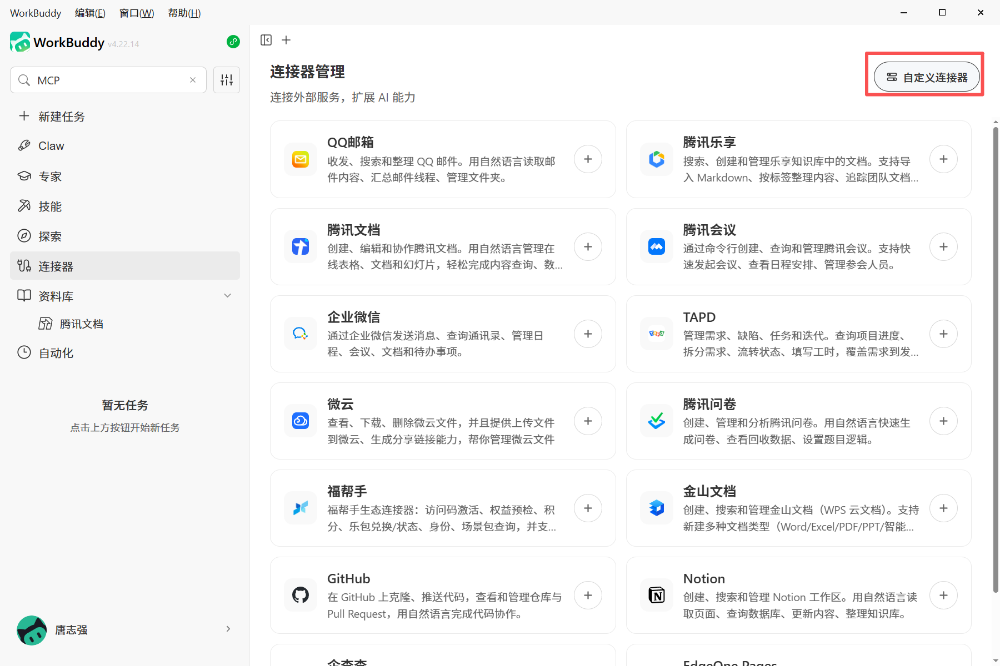
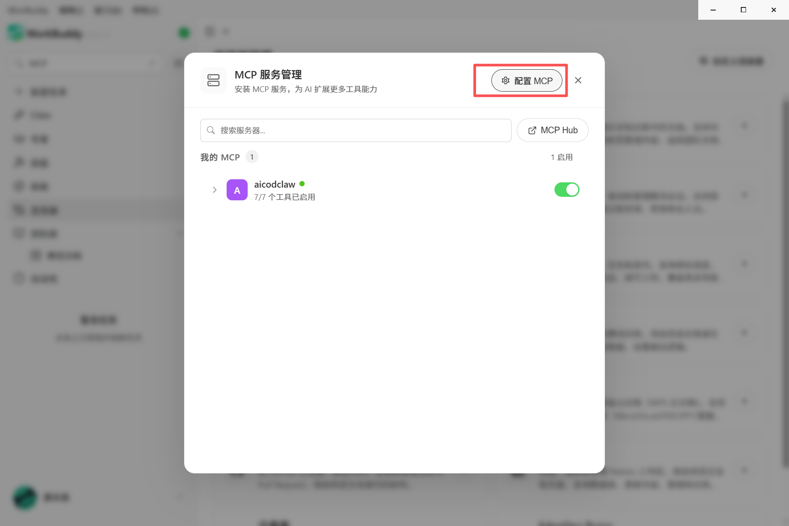
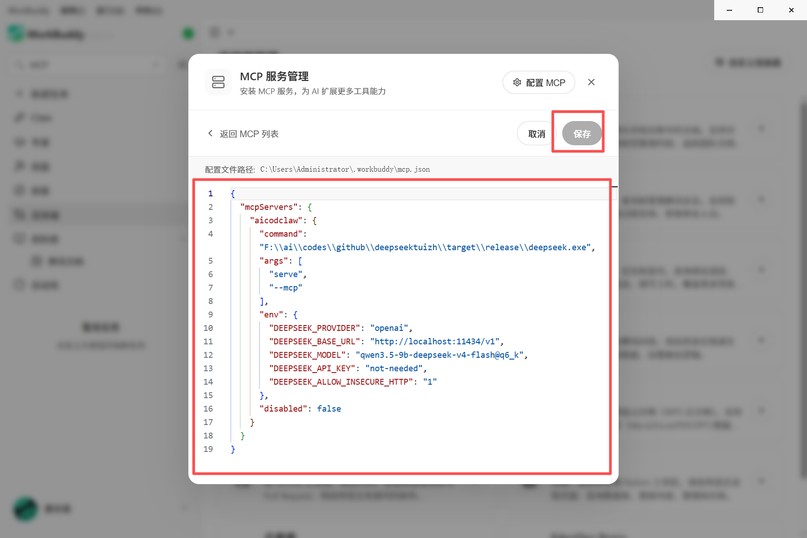

# AICodeClaw WorkBuddy 对接指南

> **AICodeClaw：开源的企业 AI 私域引擎，零泄露的 AI 软件工厂**

本文档介绍如何将 AICodeClaw 接入腾讯云 WorkBuddy，通过 MCP 协议实现私域化的 AI 能力扩展。

---

## 📋 目录

1. [配置概览](#1-配置概览)
2. [配置文件路径](#2-配置文件路径)
3. [配置代码示例](#3-配置代码示例)
4. [参数详细说明](#4-参数详细说明)
5. [快速接入步骤](#5-快速接入步骤)
6. [验证配置](#6-验证配置)
7. [常见问题排查](#7-常见问题排查)
8. [架构说明](#8-架构说明)

---

## 1. 配置概览

本配置用于在腾讯 WorkBuddy 客户端中接入 AICodeClaw 智能体服务。通过 MCP（Model Context Protocol）协议，WorkBuddy 可以调用 AICodeClaw 的以下能力：

- ✅ **本地代码分析** - 代码质量审查、静态分析
- ✅ **安全审查** - 漏洞扫描、合规性检查
- ✅ **自动化运维** - 日志分析、故障诊断
- ✅ **私域 AI 推理** - 数据不出域，零泄露风险

### 核心价值

```
WorkBuddy = 云端大脑 + 本地执行（通用办公）
AICodeClaw = 私域 AI 推理引擎（高安全场景）
```

通过 MCP 协议协作：
- ✅ 保留 WorkBuddy 的易用性
- ✅ 满足私域化安全要求
- ✅ 零数据泄露风险
- ✅ 降低 API 成本

---

## 2. 配置文件路径

WorkBuddy 的 MCP 配置文件位于：

**Windows 系统：**
```
C:\Users\<你的用户名>\.workbuddy\mcp.json
```

**macOS / Linux 系统：**
```
~/.workbuddy/mcp.json
```

**示例（Windows）：**
```
C:\Users\Administrator\.workbuddy\mcp.json
```

---

## 3. 配置代码示例

请将以下 JSON 代码复制并粘贴到你的 `mcp.json` 文件中：

```json
{
  "mcpServers": {
    "aicodclaw": {
      "command": "F:\\ai\\codes\\github\\deepseektuizh\\target\\release\\deepseek.exe",
      "args": [
        "serve",
        "--mcp"
      ],
      "env": {
        "DEEPSEEK_PROVIDER": "openai",
        "DEEPSEEK_BASE_URL": "http://localhost:11434/v1",
        "DEEPSEEK_MODEL": "qwen3.5-9b-deepseek-v4-flash@q6_k",
        "DEEPSEEK_API_KEY": "not-needed",
        "DEEPSEEK_ALLOW_INSECURE_HTTP": "1"
      },
      "disabled": false
    }
  }
}
```

> ⚠️ **注意：** 如果你的 WorkBuddy 已有其他 MCP Server 配置，请将 `aicodclaw` 添加到现有的 `mcpServers` 对象中，不要覆盖其他配置。

---

## 4. 参数详细说明

为了确保服务正常运行，请根据你的实际环境修改以下关键字段：

| 参数键名 | 类型 | 说明与建议值 |
|---------|------|------------|
| `command` | 字符串 | AICodeClaw 可执行文件的**绝对路径**。<br>⚠️ **注意：** Windows 路径需使用双反斜杠 `\\` 转义<br>示例：`"D:\\Apps\\AICodeClaw\\deepseek.exe"` |
| `args` | 数组 | 启动参数。保持默认 `["serve", "--mcp"]` 即可<br>表示以 MCP 服务模式启动 |
| `DEEPSEEK_PROVIDER` | 字符串 | 模型提供商。默认为 `"openai"` 兼容模式 |
| `DEEPSEEK_BASE_URL` | 字符串 | 本地大模型 API 地址<br>使用 Ollama 时通常为 `"http://localhost:11434/v1"` |
| `DEEPSEEK_MODEL` | 字符串 | 指定使用的模型名称<br>需与 Ollama 或本地部署的模型名称一致<br>示例：`qwen2.5-coder`、`deepseek-coder` |
| `DEEPSEEK_API_KEY` | 字符串 | API 密钥。本地模型通常填 `"not-needed"` 或任意字符 |
| `DEEPSEEK_ALLOW_INSECURE_HTTP` | 字符串 | 允许 HTTP 连接。本地调试时设为 `"1"` |

---

## 5. 快速接入步骤

### 步骤 1：准备本地模型（如使用 Ollama）

```powershell
# 安装 Ollama（如果未安装）
# 下载：https://ollama.ai

# 拉取模型
ollama pull qwen2.5-coder:7b

# 启动 Ollama（通常会自动启动）
ollama serve
```

### 步骤 2：打开 WorkBuddy 配置界面



1. 打开 WorkBuddy 客户端
2. 点击左侧菜单栏的 **"连接器"**



3. 点击右上角的 **"自定义连接器"** 按钮

### 步骤 3：配置 MCP



4. 在弹出的窗口中，点击 **"配置 MCP"**
5. 将上述 JSON 代码填入配置框中
6. 点击 **"保存"**

### 步骤 4：启用服务

7. 在 MCP 服务列表中，找到 `aicodclaw`
8. 确保右侧的开关已 **开启（绿色）**

### 步骤 5：验证连接

9. 在 WorkBuddy 中发送消息，测试是否能调用 AICodeClaw 的工具
10. 或在 TUI 中使用 `/mcp validate` 命令验证

---

## 6. 验证配置

### 方法 1：在 WorkBuddy 中验证

1. 在 WorkBuddy 中输入："使用 AICodeClaw 审查代码安全性"
2. 观察是否能正常调用工具
3. 检查响应是否来自本地模型

### 方法 2：在 TUI 中验证

```powershell
# 启动 TUI
.\target\release\deepseek

# 验证 MCP 连接
/mcp validate

# 查看状态
/mcp status
```

### 方法 3：测试 MCP Server

```powershell
# 直接启动 MCP Server
.\target\release\deepseek.exe serve --mcp
```

如果正常启动，会等待 JSON-RPC 输入，说明配置正确。

---

## 7. 常见问题排查

### 问题 1：状态显示"离线"或红点

**可能原因：**
- ❌ `command` 路径不正确
- ❌ 可执行文件不存在
- ❌ 本地模型服务未启动

**解决方案：**
```powershell
# 1. 检查文件是否存在
Test-Path "F:\ai\codes\github\deepseektuizh\target\release\deepseek.exe"

# 2. 检查 Ollama 是否运行
ollama list

# 3. 测试 MCP Server
.\target\release\deepseek.exe serve --mcp
```

### 问题 2：无法生成代码/无响应

**可能原因：**
- ❌ 模型性能不足
- ❌ 防火墙拦截

**解决方案：**
```powershell
# 1. 更换更强的模型
ollama pull deepseek-coder:6.7b

# 2. 修改配置中的 DEEPSEEK_MODEL
"DEEPSEEK_MODEL": "deepseek-coder:6.7b"

# 3. 检查防火墙
# 允许 deepseek.exe 通过网络
```

### 问题 3：MCP 工具未出现在 WorkBuddy 中

**可能原因：**
- ❌ 服务未启用（开关未打开）
- ❌ 配置格式错误

**解决方案：**
1. 检查 MCP 服务列表中 `aicodclaw` 是否为绿色
2. 使用 JSON 验证工具检查 `mcp.json` 格式
3. 重启 WorkBuddy

### 问题 4：JSON 解析错误

**可能原因：**
- ❌ 路径未使用双反斜杠
- ❌ JSON 格式错误

**解决方案：**
```json
// 错误示例（单反斜杠）
"command": "F:\ai\codes\github\deepseektuizh\deepseek.exe"

// 正确示例（双反斜杠）
"command": "F:\\ai\\codes\\github\\deepseektuizh\\deepseek.exe"
```

---

## 8. 架构说明

### 协作流程

```
用户在 WorkBuddy 输入任务
         ↓
WorkBuddy 通过 MCP 调用 AICodeClaw
         ↓
AICodeClaw 使用本地 LLM 推理（Ollama）
         ↓
结果返回 WorkBuddy
         ↓
✅ 全程数据不出域！
```

### 架构对比

| 维度 | WorkBuddy 原生 | WorkBuddy + AICodeClaw |
|------|---------------|----------------------|
| **AI 推理位置** | ☁️ 腾讯云 | 💻 本地 |
| **数据安全** | 数据出域 | 零泄露 |
| **适用场景** | 通用办公 | 金融/政企/高安全 |
| **成本** | API 调用费 | 一次性硬件投入 |

### 技术栈

- **MCP 协议**：Model Context Protocol（模型上下文协议）
- **通信方式**：stdio（标准输入输出）
- **本地模型**：Ollama + GGUF 量化模型
- **开发语言**：Rust 1.88+

---

## 📞 获取帮助

- **项目仓库**：https://github.com/your-org/aicodclaw
- **问题反馈**：提交 Issue
- **文档**：查看 `docs/zh/` 目录

---

## 📄 许可证

本项目采用 MIT 许可证开源。

---

**AICodeClaw：开源的企业 AI 私域引擎，零泄露的 AI 软件工厂** 🦞
